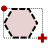
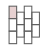

# Boardgame image Tool (BiT)
https://github.com/theksoft/bit  
HTML map creator in plain javascript featuring project with grid management.

## Menu commands

Projets are stored in local storage by the name of each map.

#### Project management commands

- `Project.Manage` : Allow to clean-up any stored project.
- `Project.New` : Setup a new HTML map project [`CTRL`+`M`].
- `Project.Load` : Load a stored HTML map project [`CTRL`+`L`]. In load dialog, a double click on project image allows exporting it on disk.
- `Project.Save` : Save HTML map project in local storage [`CTRL`+`S`].
- `Project.Save As` : Save HTML map project in local storage under a new name.
- `Project.Close` : Close current map project [`CTRL`+`X`].
- `Project.Export` : Export project to a local file (JSON text file).
- `Project.Import` : Import project from a local file (JSON text file).
- `Project.Export image` : Export project image to a local file.

#### Project commands

- `Preview` : Preview HTML map result [`CTRL`+`P`]
- `Generate` : Display HTML map code [`CTRL`+`G`]

#### Edit commands

- `Edit.Add HTML Areas` : Add areas from HTML map source code. 
  Full *\<map\>* source code or only *\<area\>* source code can be entered.
- `Edit.Set New Image` : Define a new image for the project. 

#### View commands

- `Edit.Zoom In` : Increase image and drawn areas scale [`CTRL`+`+`].
- `Edit.Zoom 1:1` : Restore default zoom i.e. the natural size of the image.
- `Edit.Zoom Out` : Decrease image and drawn areas scale [`CTRL`+`-`].

#### Other commands

- `?` : Brief help display [`F1`]

## Background image

During project creation map image can be selected between a web URL, a local image file or a template background of defined dimension and color.
Map image can be replaced at any time. In that case all areas are moved and resized depending on the previous and new image dimensions relation.
If new image is of the same size than the previous one, areas remain unchanged. 

## Drawing

Drawing is controlled by tool pallette on the right side.

#### Basic drawing

###### Drawing area

Tool                              | Description
--------------------------------- | ---
        | **Draw an hex from its diameter**   Click first to define the start of hex diameter and next click again to end the hex diameter. 
        | **Draw an hex from a delimiting rectangle**   Click first to define first corner of the delimiting rectangle and next click again for the opposing corner.   Result is the largest hex that can be inscribed in the rectangle.
    | **Draw a rectangle**   Click first to define first corner of the rectangle and next click again for the opposing corner.
       | **Draw a square**   Click first to define first corner of the square and next click again for the opposing corner.
      | **Draw a rhombus from a delimiting rectangle**   Click first to define first corner of the delimiting rectangle and next click again for the opposing corner.   Result is the rhombus inscribed in the rectangle.
   | **Draw an equilateral triangle from a delimiting rectangle**   Click first to define first corner of the delimiting rectangle and next click again for the opposing corner.   Result is the largest equilateral triangle that can be inscribed in the rectangle.   `ALT` key pressed on first click modfies the triangle orientation.
   | **Draw an isosceles triangle from a delimiting rectangle**   Click first to define first corner of the delimiting rectangle and next click again for the opposing corner.   Result is the isosceles triangle inscribed in the rectangle.   `ALT` key pressed on first click modfies the triangle orientation.
  | **Draw a right-angled triangle from a delimiting rectangle**   Click first to define first corner of the delimiting rectangle and next click again for the opposing corner.   Result is a right-angled triangle inscribed in the rectangle.   `ALT` key pressed on first click modfies the triangle orientation.
      | **Draw an ellipse from a delimiting rectangle**   Click first to define first corner of the delimiting rectangle and next click again for the opposing corner.   Result is the ellipse inscribed in the rectangle.
     | **Draw a circle from its diameter**   Click first to define the start of circle diameter and next click again to end the circle diameter.
     | **Draw a circle from its center and radius**   Click first to define the circle center and next click again when the desired radius size is reached.
      | **Draw a polygon**   Click for each point defining the polygon. Finally click on the first point to close the polygon.

- Starting area drawing cancels current selection.
- Pressing `ESC` cancels any area drawing in progress.
- For polygons, pressing `ENTER` closes the figure in progress providing at least 3 points have been defined.
- Once an area drawing ends, the resulting area is selected by default.

###### Map result (Code Generation)

- Rectangles and squares are mapped as *rectangle*.
- Circles are mapped as *circle*.
- Hexes, rhombuses, any triangles and polygons are mapped as *polygon*.   Ellipses are mapped as well as *polygon* e.g. the rhombus area inscribed in the ellipse.

Result can be fully [`CTRL`+`A`] or partially copied in clipboard using `Copy` button [`CTRL`+`C`]. It can also be exported to an HTML blob using `Export` button. 

#### Grid drawing

Grid drawing is available for all basic area patterns except polygons.
Grids represent a collection of areas of same type and size organized and aligned to form a grid.
A grid is associated to a basic area which represent the pattern for the grided areas.
Several grid can be associated to the same basic area pattern.
All grided areas are aligned on the pattern.

Only the grid shape is managed in the project.
Grided areas cannot be selected individually.
During HTML code generation, the grid shape is not mapped but all the areas included in the grid definition are mapped.

###### Drawing grid

Tool                                | Description
----------------------------------- | ---
     | **Draw an hex-shaped grid of selected pattern**   Hex grid shape is drawn from hex diameter.
 | **Draw an rectangle-shaped grid of selected pattern**.
  | **Draw an cicle-shaped grid of selected pattern**   Cicle grid shape is drawn from circle diameter.

To start grid drawing:
- Select a single existing basic area as the grid pattern
- Select the desired grid shape among rectangle, hex or circle.
- Position all the grid drawing parameters
- Draw it as if it was the related basic drawing: Grided pattern areas appears dashed aligned on the original pattern.

As for basic drawing:
- Starting grid area drawing cancels current selection.
- Pressing `ESC` cancels any area drawing in progress including grid area.
- Once grid area drawing ends, the resulting grid area is selected by default.  
  The grid mode is therefore deselected.

###### Grid drawing parameters

Grid parameters can be set independently for each grid shape.
- if no grid shape is selected, parameter change does not apply but is defined generally for any subsequent grid area drawing.
- if a single grid shape is selected, parameter change affets only the selected grid shape but does not modify general grid parameters.

_**Grid scope**_ : Toogle button

Define grid scope for pattern area.

Parameter value                 | Description
------------------------------- | ---
 | Grid includes all pattern areas strictly inscribed in grid shape.
 | Grid includes all pattern areas strictly or partially included in grid shape.

_**Grid alignment**_ : Toggle button

Define alignment of pattern within the area.

Parameter value                 | Description
------------------------------- | ---
   | Default alignment.
   | Horizontal alternate alignment (unavailable for hex).
  | Vertical alternate alignment (unavailable for hex).

_**Grid ordering**_ : Button (viewer) and toggle button (values)

Order viewer : Button

Tool                            | Description
------------------------------- | ---
      | **Show actual area order**   Button must be held down to display area numbering.

Order change : Togdle Button 
Define numbering of grided areas

Parameter value                 | Description
------------------------------- | ---
 | Numbering starts from top left and runs from left to right and then from top to bottom (default).
 | Numbering starts from top left and runs from top to bottom and then from left to right.
 | Numbering starts from bottom left and runs from bottom to top and then from left to right.
 | Numbering starts from bottom left and runs from left to right and then from bottom to top.
 | Numbering starts from bottom right and runs from riight to left and then from top to bottom.
 | Numbering starts from bottom right and runs from bottom to top and then from right to left.
 | Numbering starts from top right and runs from top to bottom and then from right to left.
 | Numbering starts from top right and runs from right to left and then from top to bottom.

_**Grid spacing (px)**_ : Numeric input

Define the space -- in pixels -- to insert between each grided area within the grid shape.

## Area selection

Area selection is possible only if no drawing patern or grid is selected.
When no area is selected, `ESC` cancels any selected basic or grid drawing mode.

Area can be selected by clicking on each individual area.
Maintaining `SHIFT` down while selecting areas results with multiple area selection.

A group of areas can be selected by clicking outside of any area and holding down mouse button.
Then moving muse while still holding down mouse button displays a tracker rectangle.
When mouse button is released, all areas strictly included in tracker rectangle are selected.

`CTRL`+`A` selects all available areas.  
When at least one area is selected, `ESC` cancels area selection.

## Area properties

#### Generic behavior

Properties can be assigned to areas.
The targeted area must first be selected.
Once selected, `href`, `alt`, `title` and `id` input allow to define the related properties (same name).
Note that:
- `Save` : Properties are actually assigned to the selected area.
- `Restore` : Cancel the changes in progress and restore the last saved properties associated to the area.

When no area are selected, hovering on an area displays the related saved area properties in the related controls.

When HTML source code is generated, defined area properties are assigned in the related *\<area\>* definition.

#### Grid specific behavior

Properties can be assigned to a grid definition like any other basic area.
When HTML source code is generated, properties defined on a grid shape are assigned to each area of the grid.

If the `[#]` pattern is used in a property definition of a grid shape, it will be replaced by the area number during the HTML source code generation.
For example if `id` property of a grid is defined with `myid[#]`, it will be instantiated with `myid1`, `myid2`, `myid3`, ... for related area number 1, 2, 3, ...

## Area operations

#### Move

A selection of areas can be moved with either mouse or keys for finer move.

###### Moving areas using mouse

- Click one of the selected and held down the left mouse button
- Moving the mouse while holding down the left button moves the selected areas
- When the mouse button is released, selected areas are assigned to their new position.

Pressing `ESC`during selected areas move cancels the move operation and reposition selected areas to their original position.

###### Moving areas with key

- `RIGHT` arrow : Move selected 1 pixel right
- `LEFT` arrow : Move selected 1 pixel left
- `UP` arrow : Move selected 1 pixel up
- `DOWN` arrow : Move selected 1 pixel down

#### Rotate

Rotation can be done on a single selected area.
If a group of areas is selected, rotation commands have no effect.

- `CTRL`+`RIGHT` arrow : Rotate the area clockwise
- `CTRL`+`LEFT` arrow : Rotate the area anti-clockwise

Rotation is the step rotation which depends on the area selected as follow:
- circle, square: no effect
- rectangle, ellipse, rhombus, isosceles triangle, right-angled triangle, polygon : +/- 90°
- hex, equilateral triangle : +/- 30°

#### Editing areas

Area edition can be done on a single selected area.
Edition is performed using edition handles appearing on area selection:
- Click and hold down the mouse button on the selected area handle.
- Move the mouse while holding down the mouse button modifying the selected area.
- Release the mouse when satisfied with the selected area new shape and size.

Pressing `ESC`during the selected area edition cancels the edition operation and set the selected area back to its original shape and size.

#### Resize or align on first selected

When selecting a group of areas, the first element can be differentiated with the color of edit handles: white for the first area slected and dark grey for the others.
Resizing and alignment commands can be done on a group of selected areas. These commands consider the virtual delimiting rectangle of each area for sizing and aligning.

The following commands are available in the tool palette:

Tool                          | Description
----------------------------- | ---
     | Resize all selected elements to the size of the first element.   The top left corner position is left unchanged.
  | Move all selected elements vertically so that their center is aligned horizontally on the first selected element center.
  | Move all selected elements horizontally so that their center is aligned vertically on the first selected element center.
  | Move all selected elements horizontally so that their left side is aligned on the first selected element left side.
  | Move all selected elements vertically so that their top side is aligned on the first selected element top side.
  | Move all selected elements horizontally so that their right side is aligned on the first selected element right side.
  | Move all selected elements vertically so that their bottom side is aligned on the first selected element bottom side.

#### Copy / Paste

###### General behavior

- `CTRL`+`C` : Copy the selected areas.
- `CTRL`+`V` : Duplicate the copied areas whether they are still selected or not and whether they still exist or not.

###### Grid area specific behavior

Grid are linked to a patern basic area.
For example when the pattern is moved or resized, the related grid content is modified.
The current copy/paste implementation is simple:
- It does not identify uniquely each area so that each area cannot be tracked over every transformation.
  The resulting assumption is that if an area has been added or deleted, grid related pattern can no more be identified and earlier copy can be *inconsistent*.
- Moving or resizing a grid pattern after the copy affects further grid pasting rendering. 

Grid supports two paste behaviors:
- `CTRL`+`V`
  * If the copy state is *consistent*, grid shape is duplicated but the copy associated to the original pattern area even if the pattern area has been included in the copied selection.
    Moreover any previous original pattern change affects the way paste renders.
  * If the copy is *inconsistent*, grid pattern is duplicated even if not included in the copied selection.
    The new grid copy is associated to the duplicated pattern and not to the original one if it still exist.
    In that case the pattern area has the same size than at the copy time.
    Note that several grids related to the same pattern are duplicated associated to the same copy of the original pattern. 
- `CTRL`+`SHIFT`+`V` : Force deep copy
  This mode enforces creating a copy of the grid pattern and associating it to the grid copy as if the state of the copy was set to *inconsistent*.

#### Delete

Pressing `DEL` suppress all selected areas.

#### Grid freeze

Pressing `CTRL`+`F8` triggers the grid specific freeze command.
It generates all the grid area so that they can further be managed independently and suppress the grid shape.
Grid properties are assigned to each newly independent area instantiating within each property the `[#]` string pattern with the related area number.

## Other operations

#### Scroll through project image

When project image is too big for work area space, it can be scrolled through using the mouse:
- No area must be selected.
- Hold down the mouse button while pressing `CTRL` key outside of any existing area.
- Move the mouse scrolling through the project image.
- Release the mouse button / key to position image at the desired scroll position.
